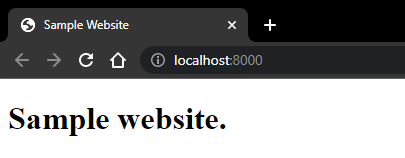

# django-tutorial
Django tutorial I wrote for the future me and other devs who can find it useful :)

1. Create git repo.
2. Clone git repo:
    ```git
    git clone https://github.com/antunesdq/django-tutorial.git
    ```
3. Create venv and activate it.
   ```ubuntu
   python3 -m venv env
   ```
   ```ubuntu
   source env/bin/activate
   ```
4. Install dependencies.
   ```ubuntu
   pip install Django
   ```
   ```ubuntu
   pip install django-cors-headers
   ```
   ```ubuntu
   pip install django-ratelimit
   ```
   ```ubuntu
   pip install djangorestframework
   ```
5.  Create requirements.txt.
   ```ubuntu
   pip freeze > requirements.txt
   ```
6.  Add .gitignore.
   ```ubuntu
   touch .gitignore
   ```

8. Add this to it:
   ```ubuntu
   env/*
   .__pycache__/*
   db.sqlite3
   .vscode/*
   ```
9. Add templates/index.html.
    ```ubuntu
    touch templates/index.html
    ```
10. Add this to it:
    ```html
    <!DOCTYPE html>
    <html>
    <head>
        <meta charset="utf-8">
        <meta name="viewport" content="width=device-width, initial-scale=1">
        <title>Sample Website</title>
    </head>

    <body>
        <header>
            <h1>Sample website.</h1>
        </header>
    </body>
    </html>
    ```
11. Create project.
    ```ubuntu
    django-admin startproject mattdq .
    ```
12. Create app.
    ```ubuntu
    django-admin startapp mattdqapp
    ```
13. Add urls.py to app.
    ```ubuntu
    touch mattdqapp/urls.py
    ```
14. Add this to it:
    ```python
    from mattdqapp import views
    from django.conf import settings
    from django.urls import re_path

    urlpatterns = [
        re_path(r'', views.simpleview)
    ]
    ```
15. Change views.
    ```python
    from django.shortcuts import render
    from django.http.response import JsonResponse
    from rest_framework import status
    from rest_framework.parsers import JSONParser
    from ratelimit.decorators import ratelimit

    # Create your views here.
    rate =1000

    @ratelimit(key='ip', rate=f'{rate}/m', block = True, method = ratelimit.ALL)
    def simpleview(request):
        if request.method == "GET":
            return render(request, 'index.html')
        else:
            return JsonResponse("You've used the wrong method.", safe= False, status = status.HTTP_405_METHOD_NOT_ALLOWED)
    ```
16. Change project url (mattdq/urls.py).
    ```python
    """mattdq URL Configuration

    The `urlpatterns` list routes URLs to views. For more information please see:
        https://docs.djangoproject.com/en/4.1/topics/http/urls/
    Examples:
    Function views
        1. Add an import:  from my_app import views
        2. Add a URL to urlpatterns:  path('', views.home, name='home')
    Class-based views
        1. Add an import:  from other_app.views import Home
        2. Add a URL to urlpatterns:  path('', Home.as_view(), name='home')
    Including another URLconf
        1. Import the include() function: from django.urls import include, path
        2. Add a URL to urlpatterns:  path('blog/', include('blog.urls'))
    """
    from django.contrib import admin
    from django.urls import re_path, include

    urlpatterns = [
        re_path('admin/', admin.site.urls),
        re_path(r'', include('mattdqapp.urls'))
    ]
    ```
17. Change project settings.
    ```python
    import os
    ```
    ```python
    try:
        SECRET_KEY = os.environ["SECRET_KEY"]
    except KeyError as e:
        raise RuntimeError("Could not find a SECRET_KEY in environment") from e
    ```
    ```python
    ALLOWED_HOSTS = ['*']
    ```
    ```python
    INSTALLED_APPS = [
        'django.contrib.admin',
        'django.contrib.auth',
        'django.contrib.contenttypes',
        'django.contrib.sessions',
        'django.contrib.messages',
        'django.contrib.staticfiles',
        'mattdq', # make sure to add this one and the lower     ones as well ←
        'corsheaders',
        'rest_framework',
    ]
    ```
    ```python
    TEMPLATES = [
        {
            'BACKEND': 'django.template.backends.django.DjangoTemplates',
            'DIRS': [os.path.join(BASE_DIR, 'templates')],
            'APP_DIRS': True,
            'OPTIONS': {
                'context_processors': [
                    'django.template.context_processors.debug',
                    'django.template.context_processors.request',
                    'django.contrib.auth.context_processors.auth',
                    'django.contrib.messages.context_processors.messages',
                ],
            },
        },
    ]
    ```
    ```python
    
    ```
18. Run this so your secret will not be exposed:
    ```ubuntu
    export SECRET_KEY='$(openssl rand -hex 40)'
    ```
    This code has to be run everytime you test it, it prevents you from pushing your secret to the repo.

19. Run it:
    ```ubuntu
    python3 manage.py runserver 0.0.0.0:8000
    ```
20. You will get this error:
    ```diff
    Watching for file changes with StatReloader
    Performing system checks...

    System check identified no issues (0 silenced).

    -You have 18 unapplied migration(s). Your project may not work properly until you apply the migrations for app(s): admin, auth, contenttypes, sessions.
    -Run 'python manage.py migrate' to apply them.
    November 06, 2022 - 07:18:32
    Django version 4.1.3, using settings 'mattdq.settings'
    Starting development server at http://0.0.0.0:8000/
    Quit the server with CONTROL-C.
    ```
21. To fix it, just run:
    ```ubuntu
    python3 manage.py makemigrations
    python3 manage.py migrate
    ```
22. Run it again:
    ```ubuntu
    python3 manage.py runserver 0.0.0.0:8000
    ```
23. The red text will be gone, click on the link and you will see this:


    Next time we will add some other things to this like react and endpoints for working with data.
    If you had issues while doing this, let me know! You can find me by antunesdq anywhere 😅